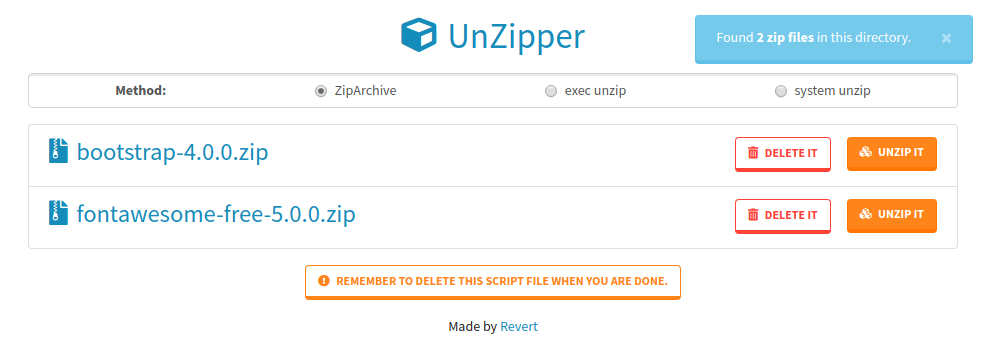

# UnZipper
Unzip zip files. One file server side simple unzipper with intuitive UI.

## Screenshot
[](screenshot.png)

## Features
- Single file script.
- Simple and intuitive.
- Few methods of unzip.
- Includes Bootstrap 4 toolkit.
- Includes FontAwesome 5 icons.
- Prevents redo action after refresh.
- Limited actions of unzip and delete:
    - only zip files may be unziped,
    - only zip files and script itself may be deleted,
    - all actions require confirmation.
- Available in few languages: EN, PL, DE, ES, RU.

## Usage
Upload `unzipper.en.php` file to your directory with zip file(s) on the server and use it in your browser:
```
http://yourdomain.com/path/to/unzipper.en.php
```
### Language change
Available: en, pl, de, es, ru.
```
http://yourdomain.com/path/to/unzipper.pl.php
```

After you are done remember to delete `unzipper.en.php` script and all unnecessary zip files.

## Download
Choose your language:
- EN: [unzipper.en.php](https://raw.github.com/riwert/unzipper/master/unzipper.en.php)
- PL: [unzipper.pl.php](https://raw.github.com/riwert/unzipper/master/unzipper.pl.php)
- DE: [unzipper.de.php](https://raw.github.com/riwert/unzipper/master/unzipper.de.php)
- ES: [unzipper.es.php](https://raw.github.com/riwert/unzipper/master/unzipper.es.php)
- RU: [unzipper.ru.php](https://raw.github.com/riwert/unzipper/master/unzipper.ru.php)
